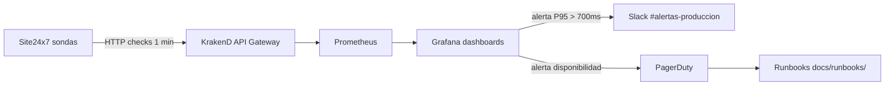

# Arquitectura de `teremoqwow`

## Visión general

Plataforma de broadcast de latencia ultra baja sobre **Media over QUIC (MoQ)**, con telemetría e interactividad sincronizadas.

```mermaid
flowchart LR
  CAM_A[Encoder A · primario] -->|SRT :8891| BOND[srt-bond relay]
  CAM_B[Encoder B · backup]   -->|SRT :8892| BOND
  BOND -->|SRT :8890 live-main| MTX[MediaMTX]
  MTX -->|RTMP/RTP| MUX[moq-mux + FFmpeg]
  MUX -->|MoQ tracks| RELAY[moq-relay-ietf]
  RELAY -->|"DTS: suscripción por selection_group"| PLAYER[@moq/watch player]
  RELAY -.federación.-> RELAY2[moq-relay peer]

  MUX --> SYNC[Sync & Telemetry]
  SYNC --> PLAYER

  PLAYER --> OVL[Overlays HTML5]
  ADAPT[Data Adapters] --> SYNC
  ADAPT --> OVL

  KRAKEND[KrakenD API Gateway] --> RELAY
  KRAKEND --> MUX
  KRAKEND --> DRM[EZDRM Multi-DRM]
  KRAKEND --> STRIPE[Stripe Billing]

  PLAYER --> DRM
  PLAYER --> STRIPE
```

### Flujo DTS

El relay retiene grupos activos según `max-age`; el player ABR conmuta suscripciones en las fronteras de grupo (cada IDR, alineado a 2 s). Los tracks High, Medium y Low se publican bajo el mismo `selection_group` en el catálogo: el relay los reenvía de forma transparente y el cliente decide cuál consumir en función del throughput medido.

## Módulos ↔ directorio ↔ agente responsable

| Módulo | Directorio | Agente (`.github/agents/`) |
|---|---|---|
| Ingesta SRT + transcodificación | [media pipeline](../adapters/) → ver `core/`, `config/` | `media-pipeline.agent.md` |
| Relay MoQ y federación | [relay/](../relay/) | `moq-core.agent.md` |
| Player y overlays | [player/](../player/), [overlays/](../overlays/) | `player-overlay.agent.md` |
| Sincronización y QoS | núcleo en `core/`, métricas en [qos/](../qos/) | `sync-telemetry.agent.md` |
| Adaptadores de datos | [adapters/](../adapters/) | `data-adapters.agent.md` |
| Monetización y DRM | [comercial/](../comercial/), [drm/](../drm/) | `monetization-drm.agent.md` |
| Portal cliente | [comercial/](../comercial/) (subcomponente) | `client-portal.agent.md` |
| Contratos y gateway | [schemas/](../schemas/), `config/krakend/` | `arquitecto.agent.md` |

## Principios

1. **Contract-first**: cualquier interacción entre módulos se define primero como esquema JSON en [`schemas/`](../schemas/).
2. **12-factor** para configuración (`config/.env.example`).
3. **CODEOWNERS estricto** para rutas críticas (`core/`, `comercial/`, `drm/`, `qos/`, `.github/`).
4. **IaC para gobernanza**: rulesets de rama versionados en `.github/rulesets/`.

## Boundaries

- `schemas/` es la única fuente de verdad de contratos; los módulos importan/validan desde aquí.
- `core/` contiene lógica común reutilizable (sync, catálogo, tipos). No conoce infraestructura.
- `relay/` y `player/` son binarios/aplicaciones; sus `Cargo.lock` / `package-lock.json` se versionan.
- `adapters/` habla con APIs externas (Opta, Stats Perform, GeoIP) y normaliza al esquema canónico.

## Fase 7 — Producción y Observabilidad

### Objetivos

Consolidar la plataforma para operación 24/7 con SLOs contractuales, monitoreo externo,
portales de cliente y desarrollador, y runbooks de respuesta a incidentes.

### Componentes añadidos

| Componente | Directorio | Descripción |
|---|---|---|
| SLA / SLOs | [docs/sla.md](sla.md) | Tabla de indicadores y penalizaciones |
| Monitoreo Site24x7 | [config/monitoring/site24x7.yaml](../config/monitoring/site24x7.yaml) | Sondas externas sobre endpoints críticos |
| Stripe Customer Portal | [comercial/stripe-portal/config.json](../comercial/stripe-portal/config.json) | Portal de autogestión de suscripción |
| Moesif Developer Portal | [comercial/moesif/config.yaml](../comercial/moesif/config.yaml) | Portal de uso, facturas y API keys |
| Runbooks | [docs/runbooks/](runbooks/) | Procedimientos de respuesta a incidentes |

### Flujo de observabilidad en Fase 7



### SLOs vigentes (Fase 7)

| Indicador | Objetivo |
|---|---|
| Disponibilidad | ≥ 99.99 % mensual |
| Latencia E2E P95 | < 700 ms |
| Tasa error HTTP 5xx | < 0.1 % |
| Lip-sync | < 45 ms |
