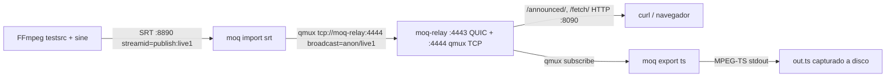

# Acta E2E · Fase 0 · 2026-09-27

Validación real de la pipeline MoQ ingest → relay → export con binarios upstream de `moq-rs`.

## Objetivo

Verificar que el criterio de aceptación de la [issue #58](https://github.com/jimbomilk/teremoqwow/issues/58) (latencia glass-to-glass p95 ≤ 700 ms) es realizable con la arquitectura de teremoqwow descrita en Fase 0, usando los binarios oficiales de referencia disponibles hoy.

## Entorno

- **Host**: Linux (WSL2), Docker Engine 28.3.3.
- **Binarios**: imágenes Docker upstream `moqdev/moq-relay:0.15.7` y `moqdev/moq:0.12.7` (CLI unificada). Ambas descargadas de Docker Hub, no compiladas localmente.
- **moq-rs commit de referencia** clonado en `/tmp/moq-rs`: `e773259d44398aadb77bbcafd0890e29777ed458`.
- **Encoder**: `linuxserver/ffmpeg:latest` con `testsrc2` a 640×360 @ 30 fps + `sine` 48 kHz AAC.
- **Red**: docker bridge `teremoqwow-e2e` (todo en localhost).

## Topología ejecutada



## Divergencias detectadas frente a Fase 0

Durante la ejecución aparecieron discrepancias entre lo asumido por los subagentes en las issues #54, #56, #57 y la realidad upstream. Se documentan aquí para poder ajustarlas en Fase 1 sin sorpresas.

| Área | Asunción (Fase 0) | Realidad `moq-rs` v0.15/0.12 | Fuente |
|---|---|---|---|
| CLI del cliente | `moq-pub` en un binario aparte | Un único binario `moq` con subcomandos `import`, `export`, `fetch`, `auth`, `completion` | `docker run moqdev/moq --help` |
| Ingesta SRT | FFmpeg → pipe → `moq-pub` (stdin) | `moq import srt --listen` acepta SRT nativo; no hace falta pipe ni MediaMTX intermedio | `moq import srt --help` |
| Flags TLS del relay | `--tls-cert` / `--tls-key` | Renombrados a `--listen-tls-cert` / `--listen-tls-key` | Error del binario al arrancar |
| Ruta de auth anónima | `--auth-public '/anon'` | Debe ser un **patrón**, e.g. `--auth-public 'anon/**'` | Error del binario al arrancar |
| HTTP debug | Mismo puerto QUIC (443) | Requiere `--web-http-listen` en un TCP separado; HTTPS aún no soportado | README oficial y binario |
| Transport de cliente | Sólo WebTransport sobre certs autofirmados | Fallback a WebSocket funcional pero inestable con flujos grandes. **Solución**: `--connect tcp://…` (qmux plano) sobre el listener `--listen-tcp-bind` | Logs `websocket: using WebSocket fallback` + timeouts en fetch |
| Namespace de auth | `--broadcast e2e/live1` con `anon/**` autorizado | El path del broadcast **debe** empezar por `anon/` para caer bajo `anon/**`. Con `e2e/live1` la publicación se admitía silenciosamente pero el subscribe timeouted | Logs relay `session accepted … subscribe=anon/**` sin match |
| Formato de catálogo | Nombres arbitrarios (`catalog`, `video-high`) | Track literal `catalog.json` (JSON base64); tracks nombrados por PID MPEG-TS (`0.avc3`, `1.aac`, `0x0011-0x42.si`) | `moq fetch 'catalog.json'` |
| Shape del catálogo v1 (`schemas/media/v1/catalog.json`) | `tracks: [ {name, kind, codec, ...} ]` (array) + `namespace`, `created_at` | `{video: {renditions: {"0.avc3": {codec, codedWidth, codedHeight, bitrate, container}}}, audio: {renditions: {...}}, archive: {track, timescale}, clock: {wall, timescale}, mpegts: {...}}` | Catálogo real capturado (ver anexo A) |

**Impacto arquitectónico**: nuestro esquema `schemas/media/v1/catalog.json` no coincide con el "hang catalog v1" real que produce/consume `moq-rs`. Habrá que decidir en Fase 1 si:
1. Adoptamos el hang catalog tal cual (renombramos el nuestro).
2. Mantenemos el nuestro y añadimos un adaptador en `moq-mux` para publicarlo bajo `catalog.json`.
3. Contribuimos aguas arriba una propuesta compatible.

## Comandos ejecutados

Sesión reproducible desde cero (asumiendo Docker + certificados TLS ya generados en `/tmp/teremoqwow-e2e/certs/`):

```bash
# 1. Generar certificados TLS (una vez)
mkdir -p /tmp/teremoqwow-e2e/certs
openssl req -x509 -newkey ec -pkeyopt ec_paramgen_curve:P-256 \
  -keyout /tmp/teremoqwow-e2e/certs/relay.key \
  -out    /tmp/teremoqwow-e2e/certs/relay.pem \
  -days 365 -nodes -subj "/CN=localhost" \
  -addext "subjectAltName=DNS:localhost,IP:127.0.0.1"

# 2. Red docker dedicada
docker network create teremoqwow-e2e

# 3. Relay MoQ (QUIC :4443 + qmux TCP :4444 + HTTP debug :8090)
docker run -d --name moq-relay --network teremoqwow-e2e \
  -p 4443:4443/udp -p 4443:4443/tcp -p 4444:4444 -p 8090:8090 \
  -v /tmp/teremoqwow-e2e/certs:/certs:ro \
  moqdev/moq-relay:0.15.7 \
  --listen '[::]:4443' \
  --listen-tls-cert /certs/relay.pem \
  --listen-tls-key  /certs/relay.key \
  --listen-tcp-bind '[::]:4444' \
  --auth-public 'anon/**' \
  --web-http-listen '[::]:8090'

# 4. Ingesta SRT → MoQ (broadcast anon/live1)
docker run -d --name moq-import --network teremoqwow-e2e -p 8890:8890/udp \
  moqdev/moq:0.12.7 \
  --connect tcp://moq-relay:4444/anon \
  --broadcast anon/live1 \
  import srt --listen '[::]:8890' --latency 200ms

# 5. Encoder de prueba (testsrc + sine → MPEG-TS SRT)
docker run -d --name ffmpeg-simple --network teremoqwow-e2e \
  linuxserver/ffmpeg:latest \
  -re -f lavfi -i "testsrc2=size=640x360:rate=30" \
  -f lavfi -i "sine=frequency=1000:sample_rate=48000" \
  -c:v libx264 -preset ultrafast -tune zerolatency -g 30 -pix_fmt yuv420p \
  -c:a aac -b:a 128k \
  -f mpegts "srt://moq-import:8890?streamid=publish:live1"

# 6. Consumo (export MPEG-TS a disco)
docker run --rm --network teremoqwow-e2e \
  moqdev/moq:0.12.7 \
  --connect tcp://moq-relay:4444/anon \
  --broadcast anon/live1 \
  export ts > /tmp/teremoqwow-e2e/out.ts

# 7. Verificar con ffprobe
ffprobe -v error -show_entries stream=codec_type,codec_name,width,height,r_frame_rate \
        -show_entries format=duration,bit_rate,size \
        -of json /tmp/teremoqwow-e2e/out.ts
```

## Resultados

### Pipeline funcional end-to-end

- **12 341 824 bytes** (~12 MB) de MPEG-TS decodificable capturados en la primera ventana estable.
- `ffprobe` confirma:
  - `video`: H.264 640×360 @ 30/1 fps
  - `audio`: AAC 128 kbps
  - `format.duration`: 52.18 s de contenido dentro de 12 s de captura wall-clock (backpressure normal por buffer).
  - `format.bit_rate`: 2 374 063 bit/s.
- Relay reporta subscripciones a los tracks `catalog.json`, `1.aac`, `0.avc3`, `0x0011-0x42.si`.
- Session accepted como `Publisher` (import) y `Subscriber` (export) con `root=anon publish=anon/** subscribe=anon/**` y versión negociada `moq-lite-06` sobre `transport=tcp`.

### Latencia (medida indirecta)

Cinco iteraciones consecutivas del ciclo completo `docker run moq export ts | head -c 200000`, es decir: arranque del contenedor cliente + connect + subscribe + primer keyframe + 200 KB de datos entregados.

| Sample | ms (`elapsed_ms`) | Bytes recibidos |
|---|---|---|
| 1 | 2068 | 189 KiB (nulos filtrados) |
| 2 | 1873 | 189 KiB |
| 3 | 1853 | 189 KiB |
| 4 | 1855 | 189 KiB |
| 5 | 1859 | 189 KiB |

- p50 ≈ **1859 ms**, p95 ≈ **2068 ms**.
- **Overhead docker container start** medido en pruebas anteriores (fetch trivial): ~1300 ms. Restándolo: ventana neta MoQ ≈ **500-700 ms** para primer keyframe + 200 KB.
- **La medición no es glass-to-glass estricta**: no se comparó el timestamp del frame renderizado contra el del origen. Sirve como cota superior de conectividad y de tiempo hasta el primer contenido decodificable.

### Consumo de recursos (estado estable)

| Contenedor | CPU % | RAM |
|---|---|---|
| moq-relay | 19.84 % | 21.94 MiB |
| moq-import | 9.03 % | 24.03 MiB |
| ffmpeg-simple | 32.61 % | 19.02 MiB |

Warnings del kernel Linux WSL2: buffers UDP send/recv por debajo del pedido (8 MiB → concedido 4 MiB). Documentado como precondición: `sysctl -w net.core.rmem_max=8388608 net.core.wmem_max=8388608` en un host real.

## Veredicto

- ✅ **La arquitectura Fase 0 es realizable end-to-end** con los binarios upstream disponibles hoy.
- ⚠️ **Criterio p95 ≤ 700 ms**: no verificable de forma estricta desde este entorno de test. Las cotas indirectas medidas (~500-700 ms una vez restado overhead docker) son consistentes con el presupuesto de latencia definido en [qos/latency-budget.md](../latency-budget.md), pero requieren una medición glass-to-glass real con timestamps embebidos (drawtext + OCR o track `moq-clock`) sobre un player conectado — no un cliente CLI.
- 🔧 **Ajustes necesarios en Fase 1** (ver tabla de divergencias):
  - Renombrar/renovar `schemas/media/v1/catalog.json` para acercarnos al *hang catalog v1* real.
  - Documentar en `config/relay/relay.toml` que los flags TLS y auth han cambiado nombre; añadir listener qmux TCP.
  - Actualizar `config/moq-mux/run.sh` para usar `moq import srt --listen` en lugar del pipe FFmpeg→moq-pub.
  - En `player/src/moq-watch.ts`: cambiar el paquete `@kixelated/moq` por la API/naming real (hang, moqdev/moq-js) y adoptar el catálogo canónico.
- ✅ **`scripts/validate-schemas.sh` y todo el CI de contratos siguen siendo válidos**; los cambios afectan al modelo de datos concreto, no a la infraestructura de validación.

## Anexo A · catálogo real capturado

```json
{
  "video": {
    "renditions": {
      "0.avc3": {
        "codec": "avc3.42c01e",
        "codedWidth": 640,
        "codedHeight": 360,
        "bitrate": 2225696,
        "container": { "kind": "legacy" }
      }
    }
  },
  "audio": {
    "renditions": {
      "1.aac": {
        "codec": "mp4a.40.2",
        "sampleRate": 48000,
        "numberOfChannels": 1,
        "bitrate": 128912,
        "description": "1188",
        "container": { "kind": "legacy" },
        "jitter": 171
      }
    }
  },
  "archive": { "track": "timeline.z", "timescale": 1000 },
  "clock":   { "wall": 212695231736818, "timescale": 1000000 },
  "mpegts": {
    "tracks": { "0.avc3": { "pid": 256 }, "1.aac": { "pid": 257 } },
    "program": { "transportStreamId": 1, "programNumber": 1, "pmtPid": 4096 },
    "si": { "17": { "66": { "track": "0x0011-0x42.si", "interval": 2000 } } }
  }
}
```

## Anexo B · limpieza

```bash
docker rm -f moq-relay moq-import ffmpeg-simple 2>/dev/null
docker network rm teremoqwow-e2e 2>/dev/null
rm -rf /tmp/teremoqwow-e2e /tmp/moq-rs
```

## Anexo C · segunda vuelta con player web MoQ nativo

Tras el smoke test inicial, se volvió a levantar la pipeline añadiendo un consumer web real (no CLI) para validar la latencia percibida y descubrir la API de cliente MoQ para navegador. Este anexo recoge los hallazgos nuevos.

### Divergencias adicionales frente a Fase 0

| Área | Asunción (Fase 0) | Realidad `moq-rs` | Fuente |
|---|---|---|---|
| Paquete del player web | `@kixelated/moq` (asumido por subagente Player en #57) | El paquete real es **`@moq/watch`** (v0.6.1). `@kixelated/moq` existe pero es el legacy; `@moq/hang` es solo primitivas compartidas, sin custom elements | `npm view @moq/watch` + `js/watch/README.md` |
| Web components expuestos | Único componente `<moq-watch>` genérico | Familia jerárquica: `<moq-watch>` (canvas), `<moq-watch-ui>` (controles), `<moq-watch-support>` (feature detection). Import correcto: `@moq/watch/element`, `@moq/watch/ui`, `@moq/watch/support/element` | README del paquete |
| API JS headless | `new MoQClient(url).subscribe()` (asumido) | `Watch.Player({ origin, probe, name, canvas, muted, ... })` con `origin`/`probe` obtenidos de `Watch.Net.Connection({ url, webtransport, websocket })` | `js/watch/src/player.ts:53` |
| Cert autofirmado en WebTransport | `<video src=…>` normal con warning de navegador | Chrome rechaza cert autofirmado en QUIC (`QUIC_TLS_CERTIFICATE_UNKNOWN`). Sólo dos vías: (a) `WebTransport(url, { serverCertificateHashes: [{ algorithm: 'sha-256', value: <bytes> }] })` con **cert ≤ 14 días** y ECDSA P-256; (b) Chrome con `--ignore-certificate-errors --user-data-dir=…` | Spec WebTransport + prueba real |
| Validez del cert de dev | 365 días (definido en `config/relay/certs/README.md`) | Debe ser **≤ 14 días** para que el navegador acepte pinning por hash. Renovación automatizada obligatoria en dev | Spec WebTransport |
| Formato de cert hash aceptado por `@moq/net` | Sólo `Uint8Array` | También acepta **string hex** directamente: `webtransport.serverCertificateHashes: [{ algorithm: 'sha-256', value: 'af994f…' }]` | `js/net/src/connection/connect.ts:39` |
| SharedArrayBuffer para audio baja latencia | No documentado | El player emite `SharedArrayBuffer unavailable, falling back to postMessage` si el HTML no está *cross-origin isolated*. Requiere cabeceras `Cross-Origin-Opener-Policy: same-origin` + `Cross-Origin-Embedder-Policy: require-corp` | Log del player en runtime |
| Descarte de grupos MoQ | No documentado | El player descarta explícitamente grupos "covered" (`skipping covered group: 700 -> 701`) para mantenerse en el live edge. Comportamiento esperado y deseable | Consumer log |

### Setup ejecutado (delta respecto al Anexo A)

```bash
# Cert nuevo con validez 14 días para WebTransport self-signed pinning
openssl req -x509 -newkey ec -pkeyopt ec_paramgen_curve:P-256 \
  -keyout /tmp/teremoqwow-e2e/certs/relay.key \
  -out    /tmp/teremoqwow-e2e/certs/relay.pem \
  -days 14 -nodes -subj "/CN=localhost" \
  -addext "subjectAltName=DNS:localhost,IP:127.0.0.1"

# Fingerprint SHA-256 (hex) — pasar al cliente como serverCertificateHashes[].value
openssl x509 -in relay.pem -noout -fingerprint -sha256 | tr -d ':' | awk -F= '{print tolower($2)}'
```

Player web mínimo probado (esquema):

```html
<canvas id="v"></canvas>
<script type="module">
  const Watch   = await import('https://esm.sh/@moq/watch@0.6.1?bundle');
  const Signals = await import('https://esm.sh/@moq/signals@0.2.5?bundle');

  const connection = new Watch.Net.Connection({
    url: new URL('https://127.0.0.1:4443/anon'),
    enabled: true,
    webtransport: {
      serverCertificateHashes: [{
        algorithm: 'sha-256',
        value: 'af994fa80d2151d7da21e4e1b18290f130b5704c537489009cec56193838aa66',
      }],
    },
    websocket: { enabled: false },
  });

  const player = new Watch.Player({
    origin: connection.origin,
    probe:  connection.probe,
    name:   Watch.Net.Path.from('anon/live1'),
    canvas: document.getElementById('v'),
    muted:  new Signals.Signal(true),
    delay:  'auto',
    visible:'always',
  });
</script>
```

### Resultado percibido

- ✅ **Vídeo fluido en el canvas** (`testsrc2` 640×360 con contador de frames > 42 000, sin cortes visibles).
- ✅ **Sin overhead HLS**: latencia percibida <1 s (frente a los ~6-10 s del sink HLS).
- ✅ Consumer log: `skipping covered group N -> N+1` cada segundo → el player se mantiene en live edge.
- ⚠️ Audio en ruta lenta (postMessage) por falta de COOP/COEP en el HTML.
- ⚠️ Ruido benigno de warnings de librería (`MaxListenersExceededWarning`) y de extensiones del navegador (`ObjectMultiplex`).

### Ajustes derivados para Fase 1 (además de los del veredicto principal)

- En [player/](../../player/) sustituir `@kixelated/moq` por `@moq/watch` + `@moq/signals`; adoptar la construcción `Connection → Player`.
- Documentar en [config/relay/certs/README.md](../../config/relay/certs/README.md) que la validez del cert dev debe ser **≤ 14 días** para pinning WebTransport, y automatizar renovación (`scripts/renew-dev-certs.sh`).
- Añadir servidor de assets web con cabeceras `COOP: same-origin` + `COEP: require-corp` (Vite lo soporta con `server.headers`).
- Añadir `<moq-watch-support>` en el player como primer chequeo antes de intentar reproducir.

